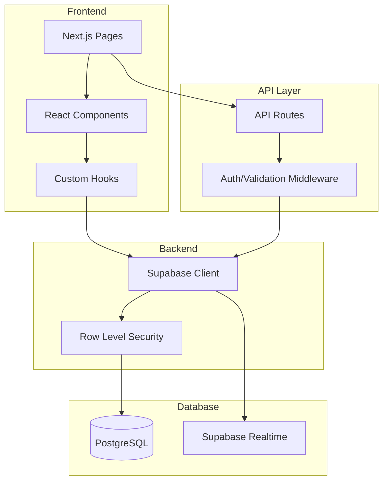
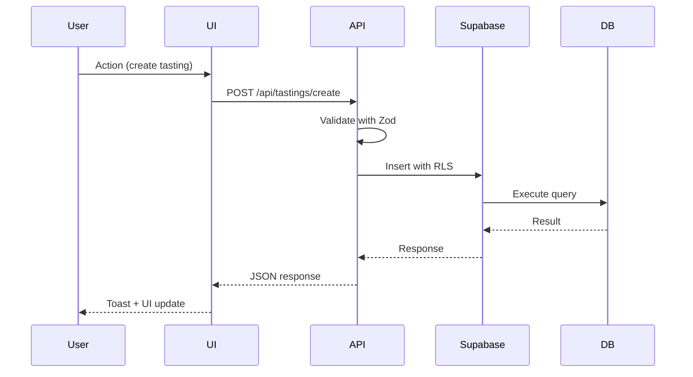
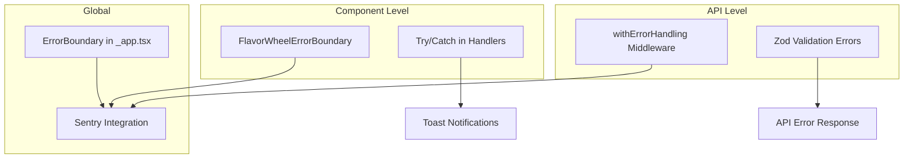

# Design Document: Flavatix Codebase Readiness Audit

## Overview

This document provides a comprehensive gap analysis of the Flavatix codebase, identifying all blockers preventing 100% production readiness. The audit covers database schemas, API endpoints, frontend components, UX state machines, error handling, and testing coverage.

## Executive Summary

**Readiness Score: 62/100**

### Production Blockers (CRITICAL)
1. **Schema Desynchronization**: Main schema.sql missing 15+ tables and 20+ columns from migrations
2. **Missing API Endpoints**: No CRUD endpoints for tasting items, participants, social features
3. **UX State Machine Failures**: Quick tasting queries non-existent tasting_participants table
4. **Contradictory Feedback**: Multiple toast patterns show success before potential failure

### Critical UX Failures
1. Edit buttons in study mode route to incorrect screens
2. Competition mode allows item addition attempts (should be blocked)
3. Success toasts fire before async operations complete
4. Counts display "N/A" when data exists but query fails

---

## Architecture

### Current System Architecture



### Data Flow



---

## Components and Interfaces

### Database Tables (Expected vs Actual)

| Table | In schema.sql | In Migrations | Status |
|-------|---------------|---------------|--------|
| profiles | ✅ | ✅ | OK |
| quick_tastings | ✅ (partial) | ✅ | **MISSING COLUMNS** |
| quick_tasting_items | ✅ (partial) | ✅ | **MISSING COLUMNS** |
| quick_reviews | ✅ | ✅ | OK |
| prose_reviews | ✅ | ✅ | OK |
| tasting_participants | ❌ | ✅ | **MISSING** |
| tasting_item_suggestions | ❌ | ✅ | **MISSING** |
| tasting_likes | ❌ | ✅ | **MISSING** |
| tasting_comments | ❌ | ✅ | **MISSING** |
| tasting_shares | ❌ | ✅ | **MISSING** |
| user_follows | ❌ | ✅ | **MISSING** |
| study_sessions | ❌ | ✅ | **MISSING** |
| study_categories | ❌ | ✅ | **MISSING** |
| study_participants | ❌ | ✅ | **MISSING** |
| study_items | ❌ | ✅ | **MISSING** |
| study_responses | ❌ | ✅ | **MISSING** |
| study_ai_cache | ❌ | ✅ | **MISSING** |
| competition_answer_keys | ❌ | ✅ | **MISSING** |
| competition_responses | ❌ | ✅ | **MISSING** |
| competition_leaderboard | ❌ | ✅ | **MISSING** |
| competition_item_metadata | ❌ | ✅ | **MISSING** |
| flavor_descriptors | ❌ | ✅ | **MISSING** |
| flavor_wheels | ❌ | ✅ | **MISSING** |
| aroma_molecules | ❌ | ✅ | **MISSING** |
| category_taxonomies | ❌ | ✅ | **MISSING** |
| ai_extraction_logs | ❌ | ✅ | **MISSING** |

### Missing Columns in quick_tastings

| Column | Type | Status |
|--------|------|--------|
| mode | TEXT | **MISSING from schema.sql** |
| study_approach | TEXT | **MISSING from schema.sql** |
| rank_participants | BOOLEAN | **MISSING from schema.sql** |
| ranking_type | TEXT | **MISSING from schema.sql** |
| is_blind_participants | BOOLEAN | **MISSING from schema.sql** |
| is_blind_items | BOOLEAN | **MISSING from schema.sql** |
| is_blind_attributes | BOOLEAN | **MISSING from schema.sql** |
| custom_category_name | TEXT | **MISSING from schema.sql** |

### API Endpoints Analysis

| Endpoint | Method | Exists | Auth | Validation | Status |
|----------|--------|--------|------|------------|--------|
| /api/tastings/create | POST | ✅ | ✅ | ✅ | OK |
| /api/tastings/[id] | GET | ❌ | - | - | **MISSING** |
| /api/tastings/[id] | PUT | ❌ | - | - | **MISSING** |
| /api/tastings/[id] | DELETE | ❌ | - | - | **MISSING** |
| /api/tastings/[id]/items | GET | ❌ | - | - | **MISSING** |
| /api/tastings/[id]/items | POST | ❌ | - | - | **MISSING** |
| /api/tastings/[id]/items/[itemId] | PUT | ❌ | - | - | **MISSING** |
| /api/tastings/[id]/items/[itemId] | DELETE | ❌ | - | - | **MISSING** |
| /api/tastings/[id]/participants | GET | ❌ | - | - | **MISSING** |
| /api/tastings/[id]/participants | POST | ❌ | - | - | **MISSING** |
| /api/tastings/study/create | POST | ✅ | ✅ | ✅ | OK |
| /api/tastings/study/join | POST | ✅ | ⚠️ | ✅ | Optional auth |
| /api/flavor-wheels/generate | POST | ✅ | ✅ | ⚠️ | Manual validation |
| /api/flavor-wheels/extract-descriptors | POST | ✅ | ✅ | ⚠️ | Manual validation |
| /api/social/likes | POST | ❌ | - | - | **MISSING** |
| /api/social/comments | POST | ❌ | - | - | **MISSING** |
| /api/social/follows | POST | ❌ | - | - | **MISSING** |

---

## Data Models

### QuickTasting (Current vs Expected)

```typescript
// CURRENT (in types.ts)
interface QuickTasting {
  id: string;
  user_id: string;
  category: string;
  custom_category_name?: string | null;
  session_name?: string;
  notes?: string;
  total_items: number;
  completed_items: number;
  average_score?: number;
  created_at: string;
  updated_at: string;
  completed_at?: string;
  mode: string;  // Used but not in schema.sql
  study_approach?: string | null;  // Used but not in schema.sql
  rank_participants?: boolean;  // Used but not in schema.sql
  ranking_type?: string | null;
  is_blind_participants?: boolean;
  is_blind_items?: boolean;
  is_blind_attributes?: boolean;
}

// EXPECTED (matches migrations)
// Same as above - types are correct, schema.sql is outdated
```

### Database Constraint Issues

```sql
-- ISSUE: schema.sql has restrictive category check
CONSTRAINT "quick_tastings_category_check" CHECK (
  category = ANY (ARRAY['coffee', 'tea', 'wine', 'spirits', 'beer', 'chocolate'])
)

-- EXPECTED: Should allow 'other' for custom categories
CONSTRAINT "quick_tastings_category_check" CHECK (
  category = ANY (ARRAY['coffee', 'tea', 'wine', 'spirits', 'beer', 'chocolate', 'other'])
)
```

---

## Detailed Gap Analysis

### A. Database Gaps

#### CRITICAL: Schema Desynchronization
- **Issue**: schema.sql is severely outdated, missing 15+ tables and 20+ columns
- **Impact**: New deployments from schema.sql will fail; documentation is misleading
- **Files**: `schema.sql`
- **Fix**: Regenerate schema.sql from production database or consolidate all migrations

#### CRITICAL: Missing RLS Policies
- **Issue**: Some tables in migrations have RLS enabled but policies may not be applied
- **Impact**: Data exposure or access denied errors
- **Tables**: tasting_participants, study_* tables
- **Fix**: Verify all RLS policies are applied in production

#### HIGH: Missing Foreign Key Indexes
- **Issue**: Some foreign keys lack indexes
- **Impact**: Slow queries on joins
- **Tables**: tasting_item_suggestions.participant_id
- **Fix**: Add missing indexes

### B. API Gaps

#### CRITICAL: Missing CRUD Endpoints
- **Issue**: No API routes for updating/deleting tastings or items
- **Impact**: Frontend uses direct Supabase calls, bypassing middleware
- **Files**: `pages/api/tastings/`
- **Fix**: Create RESTful endpoints with proper auth/validation

#### HIGH: Inconsistent Authentication
- **Issue**: Some endpoints use manual token extraction instead of middleware
- **Impact**: Inconsistent security, harder to maintain
- **Files**: `pages/api/flavor-wheels/generate.ts`
- **Fix**: Refactor to use withAuth middleware

#### MEDIUM: Missing Rate Limiting
- **Issue**: Rate limiting middleware exists but not applied to endpoints
- **Impact**: Vulnerable to abuse
- **Files**: All API routes
- **Fix**: Apply withRateLimit to public endpoints

### C. Frontend Gaps

#### CRITICAL: UX State Machine Failure - Quick Tasting
- **Issue**: QuickTastingSession.tsx calls roleService.getUserPermissions for quick mode
- **Impact**: 406 errors when tasting_participants table doesn't exist
- **Location**: `components/quick-tasting/QuickTastingSession.tsx:loadUserRole()`
- **Fix**: Already partially fixed - verify mode check is first

```typescript
// CURRENT (line ~130)
const loadUserRole = async () => {
  if (!session) return;
  
  // Quick tasting doesn't use roles - set default permissions
  if (session.mode === 'quick') {
    setUserPermissions({...});
    setUserRole('host');
    return;  // ✅ Early return is correct
  }
  // ... study mode logic
};
```

#### HIGH: Contradictory Toast Patterns
- **Issue**: Success toasts fire before async operations complete
- **Impact**: User sees "success" then "error" if operation fails
- **Locations**: Multiple components
- **Example**:
```typescript
// PROBLEMATIC PATTERN (pages/social.tsx)
toast.success('Post liked!');  // Fires immediately
// ... then async operation might fail
```

#### HIGH: Missing Loading States
- **Issue**: Some components don't show loading during async operations
- **Impact**: User confusion, double-clicks
- **Locations**: Various forms and buttons

#### MEDIUM: Missing Empty States
- **Issue**: Some lists don't handle empty data gracefully
- **Impact**: Blank screens confuse users

### D. UX State Machine Failures

#### CRITICAL: Mode Context Loss
- **Issue**: Navigating between items can lose mode context
- **Screen**: QuickTastingSession
- **User Action**: Navigate to item, then back
- **Expected**: Mode preserved
- **Actual**: Sometimes resets to default
- **Root Cause**: State not persisted to URL or session storage

#### HIGH: Edit Controls Visibility
- **Issue**: Edit buttons visible when user lacks permission
- **Screen**: Study mode as participant
- **User Action**: View session
- **Expected**: No edit controls
- **Actual**: Edit controls visible but fail on click
- **Root Cause**: Permission check happens on action, not render

#### HIGH: Competition Mode Item Addition
- **Issue**: Add item button visible in competition mode
- **Screen**: Competition session
- **User Action**: Click "Add Item"
- **Expected**: Button hidden or disabled
- **Actual**: Button visible, shows error on click
- **Root Cause**: UI doesn't check mode before rendering button

### E. Security Gaps

#### HIGH: Direct Supabase Calls
- **Issue**: Frontend makes direct Supabase calls bypassing API layer
- **Impact**: No server-side validation, harder to audit
- **Locations**: Most components
- **Fix**: Route all mutations through API endpoints

#### MEDIUM: Missing CSRF Protection
- **Issue**: CSRF middleware exists but not applied
- **Impact**: Vulnerable to CSRF attacks
- **Fix**: Apply withCsrfProtection to state-changing endpoints

### F. Testing Gaps

#### CRITICAL: No Integration Tests for APIs
- **Issue**: API endpoints have no integration tests
- **Impact**: Regressions not caught
- **Fix**: Add API integration tests

#### HIGH: No E2E Tests for Critical Flows
- **Issue**: Only responsive.spec.ts exists for E2E
- **Impact**: User flows not validated
- **Fix**: Add E2E tests for tasting creation, completion, social features

#### MEDIUM: Tests Don't Cover Error Paths
- **Issue**: Existing tests only cover happy paths
- **Impact**: Error handling not validated
- **Fix**: Add tests for failure scenarios

---

## Correctness Properties

*A property is a characteristic or behavior that should hold true across all valid executions of a system—essentially, a formal statement about what the system should do. Properties serve as the bridge between human-readable specifications and machine-verifiable correctness guarantees.*

### Property 1: Database Security Completeness
*For any* table in the database, if RLS is enabled, then there SHALL exist at least one policy for SELECT, INSERT, UPDATE, and DELETE operations (where applicable).
**Validates: Requirements 1.2**

### Property 2: Foreign Key Index Coverage
*For any* foreign key column in the database, there SHALL exist an index on that column.
**Validates: Requirements 1.4**

### Property 3: Timestamp Trigger Consistency
*For any* table with an `updated_at` column, updating any other column SHALL result in `updated_at` being set to the current timestamp.
**Validates: Requirements 1.5**

### Property 4: API Authentication Enforcement
*For any* API endpoint that modifies data, the endpoint SHALL require authentication via the withAuth middleware.
**Validates: Requirements 3.7**

### Property 5: API Input Validation
*For any* API endpoint that accepts request body input, the endpoint SHALL validate input using a Zod schema via withValidation middleware.
**Validates: Requirements 3.8**

### Property 6: Feedback Consistency
*For any* user action that triggers an async operation, the system SHALL NOT display success feedback until the operation completes successfully, and SHALL display error feedback if the operation fails.
**Validates: Requirements 4.1, 4.2, 4.5**

### Property 7: Mode-Specific Behavior
*For any* tasting session, the system SHALL enforce mode-specific constraints: quick mode SHALL NOT query participant tables, study mode SHALL load participant roles, competition mode SHALL prevent item addition.
**Validates: Requirements 5.1, 5.2, 5.3**

### Property 8: Permission-Based UI
*For any* UI control that requires permission, the control SHALL be hidden or disabled when the user lacks the required permission.
**Validates: Requirements 5.4**

### Property 9: Error Handling Completeness
*For any* async operation that can fail, the system SHALL catch the error, display user-friendly feedback, and NOT leave the UI in an inconsistent state.
**Validates: Requirements 6.2, 6.3, 6.5**

### Property 10: Social Feature Integrity
*For any* social action (like, comment, follow), the system SHALL persist the action to the database and update the UI to reflect the new state.
**Validates: Requirements 7.2, 7.3, 7.4**

---

## Error Handling

### Current Error Handling Architecture



### Error Handling Gaps

1. **Single Global ErrorBoundary**: Only one ErrorBoundary at app level; one error crashes entire app
2. **Inconsistent Error Logging**: Some errors logged to console only, not Sentry
3. **Silent Failures**: Some catch blocks swallow errors without user feedback
4. **Missing Retry Logic**: No automatic retry for transient failures

---

## Testing Strategy

### Recommended Test Structure

```
tests/
├── unit/
│   ├── lib/           # Service and utility tests
│   ├── hooks/         # Custom hook tests
│   └── components/    # Component unit tests
├── integration/
│   ├── api/           # API endpoint tests
│   └── services/      # Service integration tests
├── e2e/
│   ├── auth.spec.ts   # Authentication flows
│   ├── tasting.spec.ts # Tasting creation/completion
│   ├── social.spec.ts  # Social features
│   └── competition.spec.ts # Competition mode
└── property/
    ├── database.prop.ts # Database property tests
    └── api.prop.ts      # API property tests
```

### Testing Requirements

- **Unit Tests**: Use Jest with React Testing Library
- **Integration Tests**: Use Jest with node-mocks-http for API testing
- **E2E Tests**: Use Playwright (already configured)
- **Property Tests**: Use fast-check for property-based testing
- **Minimum 100 iterations** per property test

---

## Prioritized Action Plan

### CRITICAL (Must fix before production)

| # | Issue | Files | Effort |
|---|-------|-------|--------|
| C1 | Regenerate schema.sql from production | schema.sql | 2h |
| C2 | Add missing API endpoints for tastings CRUD | pages/api/tastings/ | 8h |
| C3 | Fix contradictory toast patterns | Multiple components | 4h |
| C4 | Add ErrorBoundary to critical sections | components/ | 2h |
| C5 | Verify all RLS policies applied | Database | 2h |

### HIGH (Should fix before production)

| # | Issue | Files | Effort |
|---|-------|-------|--------|
| H1 | Add API endpoints for social features | pages/api/social/ | 6h |
| H2 | Refactor direct Supabase calls to use API | components/ | 12h |
| H3 | Add loading states to all async operations | components/ | 4h |
| H4 | Add empty states to all lists | components/ | 3h |
| H5 | Hide edit controls based on permissions | components/quick-tasting/ | 2h |
| H6 | Add API integration tests | tests/integration/api/ | 8h |
| H7 | Add E2E tests for critical flows | tests/e2e/ | 8h |

### MEDIUM (Should fix soon after launch)

| # | Issue | Files | Effort |
|---|-------|-------|--------|
| M1 | Apply rate limiting to public endpoints | pages/api/ | 2h |
| M2 | Apply CSRF protection | pages/api/ | 2h |
| M3 | Add retry logic for transient failures | lib/ | 4h |
| M4 | Improve error messages | Multiple | 4h |
| M5 | Add property-based tests | tests/property/ | 8h |

### LOW (Nice to have)

| # | Issue | Files | Effort |
|---|-------|-------|--------|
| L1 | Add feature flags for risky features | lib/ | 4h |
| L2 | Add performance monitoring | lib/performance.ts | 2h |
| L3 | Improve logging consistency | lib/logger.ts | 2h |

---

## Specific Fixes

### C1: Regenerate schema.sql

**Exact Files**: `schema.sql`

**Exact Changes**:
1. Connect to production database
2. Run `pg_dump --schema-only` to export current schema
3. Replace schema.sql content
4. Or manually add all missing tables and columns from migrations

**Migrations Required**: None (schema.sql is documentation)

**Tests Required**: None

---

### C2: Add Missing API Endpoints

**Exact Files**: 
- `pages/api/tastings/[id]/index.ts` (new)
- `pages/api/tastings/[id]/items/index.ts` (new)
- `pages/api/tastings/[id]/items/[itemId].ts` (new)

**Exact Changes**:

```typescript
// pages/api/tastings/[id]/index.ts
import { createApiHandler, withAuth, sendSuccess, sendNotFound } from '@/lib/api/middleware';
import { getSupabaseClient } from '@/lib/supabase';

async function getTasting(req, res, context) {
  const { id } = req.query;
  const supabase = getSupabaseClient(req, res);
  
  const { data, error } = await supabase
    .from('quick_tastings')
    .select('*, quick_tasting_items(*)')
    .eq('id', id)
    .eq('user_id', context.user.id)
    .single();
    
  if (error || !data) return sendNotFound(res, 'Tasting');
  return sendSuccess(res, data);
}

async function updateTasting(req, res, context) {
  // Implementation
}

async function deleteTasting(req, res, context) {
  // Implementation
}

export default createApiHandler({
  GET: withAuth(getTasting),
  PUT: withAuth(updateTasting),
  DELETE: withAuth(deleteTasting),
});
```

**Migrations Required**: None

**Tests Required**: Integration tests for each endpoint

---

### C3: Fix Contradictory Toast Patterns

**Exact Files**:
- `components/quick-tasting/QuickTastingSession.tsx`
- `pages/social.tsx`
- `hooks/useSocialFeed.ts`

**Exact Changes**:

```typescript
// BEFORE (problematic)
const handleLike = async (postId: string) => {
  // ... optimistic update
  toast.success('Post liked!');  // ❌ Before async completes
  
  try {
    await supabase.from('tasting_likes').insert({...});
  } catch (error) {
    // Rollback and show error
    toast.error('Failed to like');  // ❌ User sees both toasts
  }
};

// AFTER (correct)
const handleLike = async (postId: string) => {
  // ... optimistic update (UI only, no toast)
  
  try {
    await supabase.from('tasting_likes').insert({...});
    toast.success('Post liked!');  // ✅ After success
  } catch (error) {
    // Rollback optimistic update
    toast.error('Failed to like');  // ✅ Only on error
  }
};
```

**Migrations Required**: None

**Tests Required**: Unit tests verifying toast behavior

---

### C4: Add ErrorBoundary to Critical Sections

**Exact Files**:
- `components/quick-tasting/QuickTastingSession.tsx`
- `pages/competition/[id].tsx`
- `pages/social.tsx`

**Exact Changes**:

```typescript
// Wrap critical sections
import { ErrorBoundary } from '@/components/ui';

function TastingPage() {
  return (
    <ErrorBoundary fallback={<TastingErrorFallback />}>
      <QuickTastingSession {...props} />
    </ErrorBoundary>
  );
}
```

**Migrations Required**: None

**Tests Required**: Tests verifying error boundary catches errors

---

### H5: Hide Edit Controls Based on Permissions

**Exact Files**: `components/quick-tasting/QuickTastingSession.tsx`

**Exact Changes**:

```typescript
// BEFORE
{currentItem && (
  <div className="mt-8 flex justify-center gap-4">
    <button onClick={handleAddNextItem}>Next Item</button>
    <button onClick={handleEndTasting}>End Tasting</button>
  </div>
)}

// AFTER
{currentItem && userPermissions.canAddItems && session.mode !== 'competition' && (
  <div className="mt-8 flex justify-center gap-4">
    <button onClick={handleAddNextItem}>Next Item</button>
    <button onClick={handleEndTasting}>End Tasting</button>
  </div>
)}
```

**Migrations Required**: None

**Tests Required**: Component tests with different permission levels
