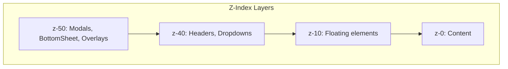

# Design Document: Flavatix UI/UX Audit

## Overview

This document provides a comprehensive analysis of UI/UX issues in the Flavatix application, focusing on modal positioning, navigation alignment, viewport handling, and mobile responsiveness. The audit identifies specific issues, their root causes, and provides actionable fixes.

## Executive Summary

**UI/UX Readiness Score: 72/100**

### Critical Issues Found
1. **Inconsistent Modal Patterns**: 8 different modal implementations with varying z-index and positioning
2. **Viewport Height Issues**: Using `h-screen` instead of `min-h-screen` in some places, causing mobile issues
3. **Bottom Navigation Overlap**: Some pages missing proper bottom padding for fixed navigation
4. **Missing Dark Mode Variants**: Several components lack complete dark mode styling

### High Priority Issues
1. Inconsistent z-index hierarchy across components
2. Touch targets below 44px minimum in some areas
3. Missing loading/empty states in some components
4. Text overflow not handled consistently

---

## Architecture

### Current Z-Index Hierarchy



### Modal Component Inventory

| Component | Location | Z-Index | Centering | Backdrop | Issues |
|-----------|----------|---------|-----------|----------|--------|
| Modal.tsx | components/ui/ | z-50 | ✅ | ✅ | None |
| BottomSheet.tsx | components/ui/ | z-50 | ✅ | ✅ | None |
| CommentsModal.tsx | components/social/ | z-50 | ✅ | ✅ | Mobile bottom alignment |
| ShareButton modal | components/sharing/ | z-50 | ✅ | ✅ | None |
| PreviewModal (study) | pages/taste/create/study/ | z-50 | ✅ | ✅ | None |
| PreviewModal (competition) | pages/taste/create/competition/ | z-50 | ✅ | ✅ | None |
| CategorySelector loading | components/quick-tasting/ | z-50 | ✅ | ✅ | None |
| BarcodeScanner | components/ | z-50 | N/A | Full screen | None |

### Fixed Element Inventory

| Element | Location | Z-Index | Position | Safe Area |
|---------|----------|---------|----------|-----------|
| BottomNavigation | components/navigation/ | z-50 | fixed bottom | ✅ |
| AppShell header | components/layout/ | z-40 | sticky top | ❌ |
| PageHeader | components/layout/ | z-40 | sticky top | ❌ |
| Dashboard header | pages/dashboard.tsx | z-40 | sticky top | ❌ |
| Social header | pages/social.tsx | z-40 | sticky top | ❌ |
| PWA install banner | hooks/usePWA.tsx | z-50 | fixed bottom | ⚠️ Conflicts |
| Offline banner | hooks/usePWA.tsx | z-50 | fixed top | ❌ |

---

## Components and Interfaces

### Modal Component Analysis

#### Standard Modal (components/ui/Modal.tsx)
```typescript
// CURRENT IMPLEMENTATION - GOOD
className="fixed inset-0 z-50 flex items-center justify-center p-4 bg-black/50 backdrop-blur-sm"
```
✅ Correct z-index (z-50)
✅ Proper centering (flex items-center justify-center)
✅ Backdrop with blur
✅ Focus trap implemented
✅ Escape key handling
✅ Body scroll lock

#### CommentsModal (components/social/CommentsModal.tsx)
```typescript
// CURRENT IMPLEMENTATION - ISSUE
className="fixed inset-0 bg-black bg-opacity-50 z-50 flex items-end sm:items-center justify-center"
```
⚠️ Mobile: `items-end` positions modal at bottom (intentional for mobile UX)
⚠️ Missing focus trap
⚠️ Missing escape key handling
⚠️ Missing body scroll lock

### Navigation Component Analysis

#### BottomNavigation (components/navigation/BottomNavigation.tsx)
```typescript
// CURRENT IMPLEMENTATION - GOOD
className={cn(
  'fixed bottom-0 left-0 right-0 z-50',
  'bg-white dark:bg-zinc-900',
  'border-t border-gemini-border dark:border-zinc-700/50',
  'shadow-[0_-4px_20px_rgba(0,0,0,0.03)]',
  'safe-area-bottom'
)}
style={{ paddingBottom: 'env(safe-area-inset-bottom)' }}
```
✅ Correct z-index (z-50)
✅ Safe area handling
✅ Dark mode support
⚠️ Height: 60px + safe area (nav) + 16px spacer = ~76px+ total

---

## Data Models

### Issue Tracking Model

```typescript
interface UIIssue {
  id: string;
  category: 'modal' | 'navigation' | 'viewport' | 'touch' | 'overflow' | 'dark-mode' | 'animation';
  severity: 'critical' | 'high' | 'medium' | 'low';
  component: string;
  file: string;
  description: string;
  currentBehavior: string;
  expectedBehavior: string;
  fix: string;
}
```

---

## Detailed Issue Analysis

### A. Modal Issues

#### ISSUE M1: CommentsModal Missing Accessibility Features
- **Severity**: High
- **File**: `components/social/CommentsModal.tsx`
- **Current**: No focus trap, no escape key handling
- **Expected**: Focus trapped within modal, Escape closes modal
- **Fix**: Add useFocusTrap hook and onEscape handler

#### ISSUE M2: Inline Modals Not Using Standard Modal Component
- **Severity**: Medium
- **Files**: `pages/taste/create/study/new.tsx`, `pages/taste/create/competition/new.tsx`
- **Current**: Custom modal implementations
- **Expected**: Use standard Modal component for consistency
- **Fix**: Refactor to use `components/ui/Modal.tsx`

### B. Navigation Issues

#### ISSUE N1: Inconsistent Bottom Padding
- **Severity**: High
- **Files**: Multiple pages
- **Current**: Some pages use `pb-20`, some use `pb-24`, some missing
- **Expected**: Consistent `pb-20` (80px) or use AppShell which handles this
- **Affected Pages**:
  - `pages/social.tsx` - has `pb-20` ✅
  - `pages/dashboard.tsx` - has `pb-24` ⚠️ (inconsistent)
  - `pages/taste.tsx` - uses PageLayout ✅
  - `pages/my-tastings.tsx` - missing explicit padding ❌

#### ISSUE N2: PWA Banner Conflicts with Bottom Navigation
- **Severity**: Medium
- **File**: `hooks/usePWA.tsx`
- **Current**: Install banner at `bottom-20` may overlap with content
- **Expected**: Banner should account for bottom navigation
- **Fix**: Adjust positioning to `bottom-24` or use portal

### C. Viewport Issues

#### ISSUE V1: Using h-screen Instead of min-h-screen
- **Severity**: High
- **Files**: `pages/social.tsx`, `pages/sample.tsx`
- **Current**: `h-screen` causes issues on mobile with browser chrome
- **Expected**: Use `min-h-screen` for full-height layouts
- **Fix**: Replace `h-screen` with `min-h-screen` or use `h-[100dvh]`

```typescript
// BEFORE
<div className="flex h-screen flex-col">

// AFTER
<div className="flex min-h-screen flex-col">
// OR for true viewport height on mobile
<div className="flex h-[100dvh] flex-col">
```

#### ISSUE V2: Missing Overflow Handling on Body
- **Severity**: Medium
- **File**: `styles/globals.css`
- **Current**: `overflow-x: hidden` on html,body ✅
- **Status**: Already handled correctly

### D. Touch Target Issues

#### ISSUE T1: Small Close Buttons
- **Severity**: Medium
- **File**: `components/social/CommentsModal.tsx`
- **Current**: Close button is `w-8 h-8` (32px)
- **Expected**: Minimum 44x44px
- **Fix**: Change to `w-11 h-11` or `min-w-[44px] min-h-[44px]`

#### ISSUE T2: Navigation Item Touch Targets
- **Severity**: Low
- **File**: `components/navigation/BottomNavigation.tsx`
- **Current**: Items are `w-12` (48px) ✅
- **Status**: Meets minimum requirements

### E. Text Overflow Issues

#### ISSUE O1: Missing Truncation on User Names
- **Severity**: Medium
- **Files**: Various components displaying user names
- **Current**: Long names can break layouts
- **Expected**: Truncate with ellipsis
- **Fix**: Add `truncate` class to name displays

#### ISSUE O2: Comment Text Overflow
- **Severity**: Low
- **File**: `components/social/CommentsModal.tsx`
- **Current**: Has `break-words` ✅
- **Status**: Already handled correctly

### F. Dark Mode Issues

#### ISSUE D1: Inconsistent Dark Mode on Inputs
- **Severity**: Medium
- **File**: `components/social/CommentsModal.tsx`
- **Current**: Input has `dark:border-zinc-600` but missing dark background
- **Expected**: Consistent dark mode styling
- **Fix**: Add `dark:bg-zinc-700` to input

#### ISSUE D2: Missing Dark Mode on Some Text
- **Severity**: Low
- **Files**: Various
- **Current**: Some text uses `text-zinc-900` without dark variant
- **Expected**: All text should have dark mode variant
- **Fix**: Add `dark:text-zinc-50` or use semantic color classes

---

## Correctness Properties

*A property is a characteristic or behavior that should hold true across all valid executions of a system—essentially, a formal statement about what the system should do. Properties serve as the bridge between human-readable specifications and machine-verifiable correctness guarantees.*

### Property 1: Modal Z-Index Hierarchy
*For any* modal component in the application, the modal container SHALL have a z-index of z-50 or higher, ensuring it appears above all navigation elements (z-40) and content (z-0).
**Validates: Requirements 1.2, 1.5**

### Property 2: Modal Centering
*For any* modal component, the modal container SHALL use `fixed inset-0` positioning with `flex items-center justify-center` to center the modal within the viewport.
**Validates: Requirements 1.1**

### Property 3: Modal Backdrop Coverage
*For any* modal component, the backdrop overlay SHALL cover the entire viewport using `fixed inset-0` positioning with a semi-transparent background.
**Validates: Requirements 1.3**

### Property 4: Modal Viewport Constraints
*For any* modal component, the modal content SHALL have `max-h-[90vh]` or similar constraint with `overflow-y-auto` to prevent overflow beyond viewport boundaries.
**Validates: Requirements 1.6**

### Property 5: Bottom Navigation Consistency
*For any* page using BottomNavigation, the navigation SHALL have z-index z-50, fixed bottom positioning, and safe area handling via `env(safe-area-inset-bottom)`.
**Validates: Requirements 2.1, 2.2, 2.6**

### Property 6: Navigation Item Alignment
*For any* navigation item in BottomNavigation, the item SHALL use `flex flex-col items-center` to vertically center icons and labels.
**Validates: Requirements 2.4, 2.5**

### Property 7: Content Bottom Padding
*For any* page with BottomNavigation, the main content area SHALL have bottom padding of at least `pb-20` (80px) to prevent content from being hidden behind the navigation.
**Validates: Requirements 2.3**

### Property 8: Full Height Layouts
*For any* page requiring full viewport height, the layout SHALL use `min-h-screen` rather than `h-screen` to properly handle mobile browser chrome.
**Validates: Requirements 3.1, 3.2**

### Property 9: Horizontal Overflow Prevention
*For any* container in the application, the container SHALL NOT cause horizontal scrolling, verified by `overflow-x-hidden` on body and proper width constraints on content.
**Validates: Requirements 3.3**

### Property 10: Z-Index Hierarchy Consistency
*For any* component using z-index, the z-index SHALL follow the hierarchy: modals/overlays (z-50) > dropdowns (z-40) > sticky headers (z-40) > content (z-0).
**Validates: Requirements 4.1, 4.4, 4.5**

### Property 11: Touch Target Minimum Size
*For any* interactive element (button, link, input), the element SHALL have minimum dimensions of 44x44 pixels via `min-h-[44px] min-w-[44px]` or equivalent.
**Validates: Requirements 5.1, 5.2, 5.3**

### Property 12: Loading State Presence
*For any* component that fetches data asynchronously, the component SHALL display a loading indicator while data is being fetched.
**Validates: Requirements 6.1**

### Property 13: Empty State Presence
*For any* list or collection component, the component SHALL display an empty state with helpful messaging when no data exists.
**Validates: Requirements 6.2**

### Property 14: Text Overflow Handling
*For any* text element that may contain long content, the element SHALL use `truncate` for single-line text or `break-words` for multi-line text to prevent layout overflow.
**Validates: Requirements 8.1, 8.2, 8.3, 8.4**

### Property 15: Focus Trap in Modals
*For any* modal component, focus SHALL be trapped within the modal while open, implemented via useFocusTrap hook or equivalent.
**Validates: Requirements 9.2**

### Property 16: Focus Return on Modal Close
*For any* modal component, when the modal closes, focus SHALL return to the element that triggered the modal opening.
**Validates: Requirements 9.3**

### Property 17: Escape Key Modal Dismissal
*For any* modal or dropdown component, pressing the Escape key SHALL close the component.
**Validates: Requirements 9.5**

### Property 18: Dark Mode Coverage
*For any* component with background, text, or border colors, the component SHALL have corresponding dark mode variants using `dark:` prefix classes.
**Validates: Requirements 10.1, 10.2, 10.3**

### Property 19: Reduced Motion Support
*For any* component with animations, the component SHALL respect `prefers-reduced-motion` via `motion-reduce:` classes or media queries.
**Validates: Requirements 11.2**

### Property 20: Input Focus States
*For any* form input element, the input SHALL have visible focus states using `focus:` or `focus-visible:` classes.
**Validates: Requirements 12.2**

### Property 21: Input Font Size for iOS
*For any* form input element, the input SHALL have font-size of at least 16px to prevent iOS zoom on focus.
**Validates: Requirements 12.4**

---

## Error Handling

### Modal Error Boundaries

Each modal should be wrapped in an ErrorBoundary to prevent modal errors from crashing the entire application:

```typescript
<ErrorBoundary fallback={<ModalErrorFallback onClose={onClose} />}>
  <Modal isOpen={isOpen} onClose={onClose}>
    {children}
  </Modal>
</ErrorBoundary>
```

### Graceful Degradation

- If focus trap fails, modal should still function
- If safe area detection fails, use fallback padding
- If dark mode detection fails, default to light mode

---

## Testing Strategy

### Unit Tests

- Test modal z-index values
- Test navigation component structure
- Test touch target dimensions
- Test dark mode class presence

### Property-Based Tests

- Use fast-check to generate random component props
- Verify z-index hierarchy across all components
- Verify touch target sizes meet minimums
- Verify dark mode variants exist

### E2E Tests

- Test modal opening/closing on mobile
- Test navigation visibility during scroll
- Test viewport handling on orientation change
- Test keyboard navigation through modals

### Visual Regression Tests

- Capture screenshots at key breakpoints
- Compare modal positioning across devices
- Verify dark mode appearance

---

## Prioritized Fix Plan

### CRITICAL (Fix Immediately)

| # | Issue | Files | Effort |
|---|-------|-------|--------|
| C1 | Fix h-screen usage | pages/social.tsx, pages/sample.tsx | 30min |
| C2 | Add missing bottom padding | pages/my-tastings.tsx | 15min |
| C3 | Add focus trap to CommentsModal | components/social/CommentsModal.tsx | 1h |

### HIGH (Fix Before Release)

| # | Issue | Files | Effort |
|---|-------|-------|--------|
| H1 | Standardize modal implementations | pages/taste/create/**/new.tsx | 2h |
| H2 | Fix touch target sizes | components/social/CommentsModal.tsx | 30min |
| H3 | Add escape key handling | components/social/CommentsModal.tsx | 30min |
| H4 | Consistent bottom padding | Multiple pages | 1h |

### MEDIUM (Fix Soon)

| # | Issue | Files | Effort |
|---|-------|-------|--------|
| M1 | Dark mode input styling | components/social/CommentsModal.tsx | 30min |
| M2 | Text truncation | Various components | 1h |
| M3 | PWA banner positioning | hooks/usePWA.tsx | 30min |

### LOW (Nice to Have)

| # | Issue | Files | Effort |
|---|-------|-------|--------|
| L1 | Consistent transition durations | Various | 1h |
| L2 | Add motion-reduce support | Various | 2h |

---

## Specific Fixes

### C1: Fix h-screen Usage

**Files**: `pages/social.tsx`, `pages/sample.tsx`

```typescript
// BEFORE
<div className="flex h-screen flex-col">

// AFTER
<div className="flex min-h-screen flex-col">
```

### C3: Add Focus Trap to CommentsModal

**File**: `components/social/CommentsModal.tsx`

```typescript
import { useFocusTrap } from '@/hooks/useFocusTrap';

export default function CommentsModal({ ... }) {
  const { containerRef } = useFocusTrap({
    isActive: isOpen,
    returnFocusOnDeactivate: true,
    onEscape: onClose,
  });

  // Add body scroll lock
  useEffect(() => {
    if (!isOpen) return;
    document.body.style.overflow = 'hidden';
    return () => {
      document.body.style.overflow = 'unset';
    };
  }, [isOpen]);

  return (
    <div className="fixed inset-0 bg-black bg-opacity-50 z-50 flex items-end sm:items-center justify-center">
      <div
        ref={containerRef}
        role="dialog"
        aria-modal="true"
        tabIndex={-1}
        className="..."
      >
        {/* ... */}
      </div>
    </div>
  );
}
```

### H2: Fix Touch Target Sizes

**File**: `components/social/CommentsModal.tsx`

```typescript
// BEFORE
<button
  onClick={onClose}
  className="w-8 h-8 flex items-center justify-center rounded-full hover:bg-zinc-100"
>

// AFTER
<button
  onClick={onClose}
  className="w-11 h-11 min-w-[44px] min-h-[44px] flex items-center justify-center rounded-full hover:bg-zinc-100 dark:hover:bg-zinc-700"
>
```

